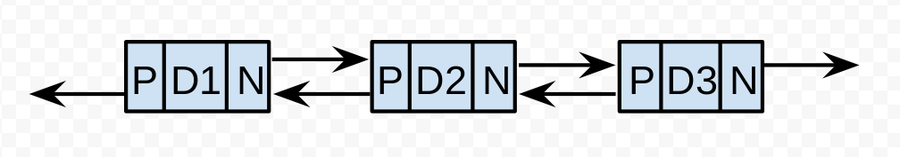

# Algorith-MX Group - Session 4

## Topic: Linked Lists

### Overview 

A _list_ is a simple structure that works as a sequence of objects/data where they are arranged in a "linear" order, this means that every object is after another.

Even when this sounds as an array there's an important difference: the access in an array is marked by a index to every element and in a _List_  the access is determined by a _pointer_ in each element. This pointer is a representation of where we are on the _List_  and which data is accesible for us. 

### Pointers

A pointer is a representation of where you're in a _list_. You can imagine this as the marker on a mall map saying to you where you're inside of the mall or even to the marker on the subway to telling you which station you're. With the pointers you can have control over how you move on the list but this can also be dangerous if you aren't careful because you can lose a position or even you can lose access to the list.

#### The HEAD and the TAIL

In a _List_ it is commonly often to talk about the `HEAD` pointer, this pointer is a representation of where the _list_  starts, once you have access to the `HEAD` you can _iterate_ over the next elements.

When we talk about the `TAIL` we talk about the last element on the list, after this element there's no other element it's common that insertions to the _list_ are made by the `TAIL` but this is not mandatory.

### Nodes

The elements in the list are commonly called _nodes_, a node is a representation of a data element in the list plus his pointer. 

Next is an image that represents a single node


In this image the letter **D** represents the _data_ and **P** represents the _pointer_ part.

If you want a code representation this coul be easly made showing a list of `integers`in java:

```java
class Node {
  int data;
  Node pointer;
}
```

Other languages may be different, but the idea its the same at the end, your nodes contain data and a pointer to other `Node` 

It is often that the pointer is called `next` because it indicates that it points to the next element in the list.

### LinkedLists

_Lists_ as a concept exist in a lot of types, the most common type is the **LinkedList** which is a kind of _list_ where every `Node` points to another `Node` from `HEAD` to `TAIL`


In here it's visible how every node points to the next. Having the last node to pointing to _nothing_, this is often represented with `NIL` in some books related to algorithms and in books related to programming with a `NULL`

Having this list, we can say that the first node, containing data `D1` is the `HEAD` and the last node, containing data `D4` is the `TAIL` 

#### Doubly LinkedList

Another type of **LinkedList** is the **DoubleLinkedList** which is a _list_ whose nodes contains two pointers, one to the last element and one to the next element. An example of this is visible in the next figure:



In this example, **P** is a pointer to the _previous_ node, **Dx** corresponds to the data and **N** corresponds to a pointer to the _next_ node. This could also be represented in code easyly:

```java
class DoubleLinkedNode {
  Node previous;
  int data;
  Node next;
}
```

### Operations

A _list_ is considered a _dynamic set_ (not to get confused with the data structure `Set`) and it contains two kind of operations:

* **Queries**: Return information about the _dynamic set_ without modifying it.
* **Modifying operations**: Change the set

#### Query operations

##### search(k) -> Node

The parameter `k` is used as a value to search inside of the _list_ and if it exists inside of the _list_ a pointer to the element it's returned.

##### minimum()

Returns the smallest data on the _list_ , this is suppossed to work on a _totally ordered dynamic set_ 

##### maxium()

Returns the greatest data on the _list_, this is suppossed to work on a _totally ordered dynamic set_

##### successor(x)

Given a `Node` _x_ returns a pointer to the next larger element in the _list_ or `NULL` if _x_ is the maximum element.

##### predecessor(x)

Given a `Node` _x_ returns a pointer to the next smaller element in the _list_ or `NULL` if _x_ is the minimum element.

#### Modifying operations

##### insert(x)

Given a `Node` _x_ it augments the _dynamic set_ by the end, in _lists_ this mean to append the `Node` to the `TAIL` pointer and turn _x_ into the new `TAIL` pointer.

##### delete(x)

Given a `Node` _x_ it removes the `Node` from the _dynamic set_ and reassing the pointer that previously pointed to _x_ to `x.next` 

#### Note on operations

Actually, this are the _theoric base_ operations for ALL DYNAMIC SETS, but somes of this data structures can actually contain more operations or even not implement some of the _base_ operations, for example, _Java_ version of `List` doesn't contain an implementation of _maximum_ or _minimum_ and the names for insertion and delete are different. This is because modern languages doesn't only work with numbers and the implementation of some methods could lead to errors or weird behaivors.

### Complexity times 

|         | Access | Search | Insertion | Deletion |
| ------- | :----: | :----: | :-------: | :------: |
| Average |  O(n)  |  O(n)  |   O(1)    |   O(1)   |
| Worst   |  O(n)  |  O(n)  |   O(1)    |   O(1)   |

### Advantage over Arrays

After all the explanation and seeing the _Complexity times_ a _list_ doesn't sound as your first choice for a data structure, because it doesn't provide constant time to the elements. 

The main advantage is that a _list_ is a _dynamic set_ as mentioned before, this means that it can grow or shrink _dynamically_ and this gives the benefit of adding and removing by the front or by the end.

An array is _static set_, this means that it cannot grow or shrink without creating a new array.

